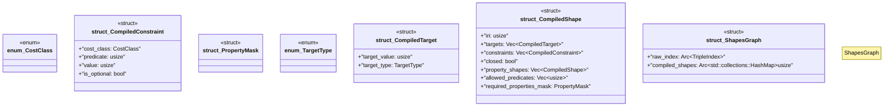

# `crates/praxis-graphlaw/src/shacl/model.rs`

Source SHA-256: `d70a18acc13aa31ea9e095f5c711ba03c964d55d73cbef01e06e55c7e3e89bc2`

## Dependencies

- `crate::encoding::Encoder`
- `crate::parser::Syntax`
- `crate::tripleindex::TripleIndex`
- `std::sync::Arc`
- `super::index_utils::get_objects`

## Standing

- Structural parse: `ALIVE`
- Runtime behavior: `UNKNOWN`
