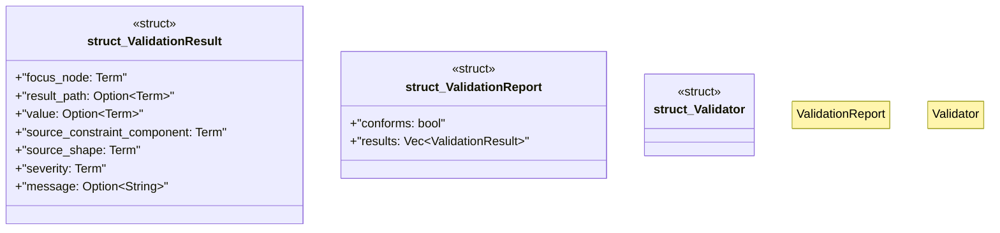

# `crates/praxis-graphlaw/src/shacl/report.rs`

Source SHA-256: `7bf9280ad5f62e84f3eaee1425b3e19bca68a97da7feed0b2d9991429e3ef481`

## Dependencies

- `crate::tripleindex::TripleIndex`
- `crate::triples::{Term, Triple, VarOrTerm}`
- `std::collections::HashSet`
- `super::Vocab`
- `super::closure::SubclassClosure`
- `super::index_utils::is_shape_deactivated`
- `super::index_utils::{get_objects, get_subjects, get_triples_by_predicate}`
- `super::model::ShapesGraph`
- `super::targets_paths::get_focus_nodes`
- `super::validate::validate_shape`

## Standing

- Structural parse: `ALIVE`
- Runtime behavior: `UNKNOWN`
