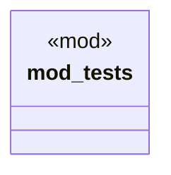

# `crates/praxis-graphlaw/src/shacl/shacl_test.rs`

Source SHA-256: `ea856b8729f8dbe087de273c7f52619be8cdbcf1b5855cabb2d2275afd63d0e2`

## Dependencies

- `super::super::closure::ClosureMatrix`
- `super::super::model::{ CompiledConstraint, CompiledShape, CompiledTarget, CostClass, PropertyMask, TargetType, SHACL_SPARQL_BOUNDARY, }`

## Standing

- Structural parse: `ALIVE`
- Runtime behavior: `UNKNOWN`
