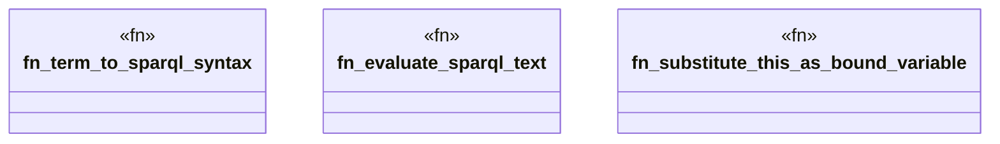

# `crates/praxis-graphlaw/src/shacl/sparql.rs`

Source SHA-256: `e722099170f84b7f0bb7dd3fc08c73a31f039fdd9d2aebe24e5ba7981db7b543`

## Dependencies

- `crate::encoding::Encoder`
- `crate::tripleindex::TripleIndex`
- `crate::triples::Term`
- `super::Vocab`
- `super::index_utils::get_objects`
- `super::messages::make_result`
- `super::messages::{get_shape_messages, pick_preferred_message}`
- `super::model::SHACL_SPARQL_BOUNDARY`
- `super::report::ValidationResult`
- `super::values::get_lexical_form`

## Standing

- Structural parse: `ALIVE`
- Runtime behavior: `UNKNOWN`
