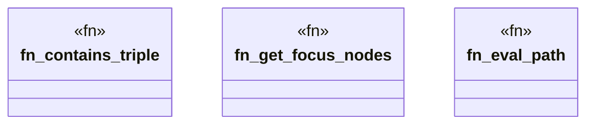

# `crates/praxis-graphlaw/src/shacl/targets_paths.rs`

Source SHA-256: `b624f168c6399b3db8f213a0282e35d68eb9caf0ac86cd2eb0b335dffcee167f`

## Dependencies

- `crate::encoding::Encoder`
- `crate::tripleindex::TripleIndex`
- `std::collections::HashSet`
- `super::Vocab`
- `super::index_utils::{get_objects, get_rdf_list, get_subjects, is_blank_node}`
- `super::sparql::evaluate_sparql_text`
- `super::values::get_lexical_form`

## Standing

- Structural parse: `ALIVE`
- Runtime behavior: `UNKNOWN`
