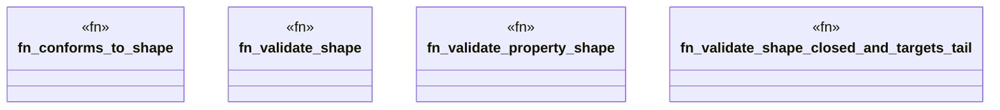

# `crates/praxis-graphlaw/src/shacl/validate.rs`

Source SHA-256: `d68c6d782520cc2955209e93eae6ce6948e46711561d2a9d6d868c17d7d313d6`

## Dependencies

- `crate::tripleindex::TripleIndex`
- `std::collections::HashSet`
- `super::Vocab`
- `super::closure::SubclassClosure`
- `super::closure::has_class`
- `super::index_utils::get_objects`
- `super::index_utils::{is_blank_node, is_iri, is_literal, is_shape_deactivated}`
- `super::index_utils::{is_blank_node, is_iri, is_literal}`
- `super::messages::{get_severity, get_shape_messages, make_result, pick_preferred_message}`
- `super::report::ValidationResult`
- `super::sparql::{check_sparql_boundary, validate_sparql_constraint}`
- `super::targets_paths::eval_path`
- `super::values::{compare_numeric, get_lang_tag, match_regex}`
- `super::values::{decode_to_term, get_integer_value, get_string_representation}`

## Standing

- Structural parse: `ALIVE`
- Runtime behavior: `UNKNOWN`
