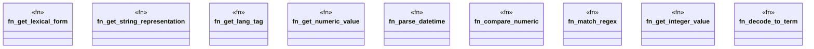

# `crates/praxis-graphlaw/src/shacl/values.rs`

Source SHA-256: `d934a55140154766c391e73316ddd8614a96523d550837f58633ad004fa07670`

## Dependencies

- `crate::encoding::Encoder`
- `crate::triples::Term`

## Standing

- Structural parse: `ALIVE`
- Runtime behavior: `UNKNOWN`
