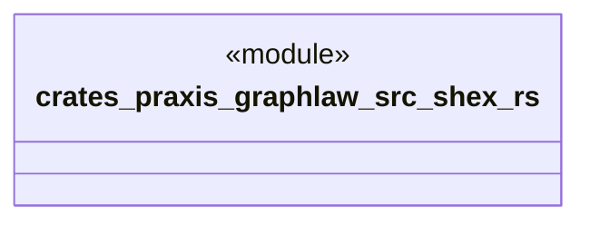

# `crates/praxis-graphlaw/src/shex.rs`

Source SHA-256: `5f016b0918f430b46b320d685d01a231b5163d127b35cb108c5ccd158916a55e`

## Dependencies

- `crate::shex_native::{ validate_shex_native as validate_shex, ShexValidationFailure, ShexValidationReport, }`

## Standing

- Structural parse: `ALIVE`
- Runtime behavior: `UNKNOWN`
