# `crates/praxis-graphlaw/src/shex_native.rs`

Source SHA-256: `c5c2eef192deb93e06ecf12131ff5a48c178a3b81a1f163264503ce5a4fed659`

```mermaid
classDiagram
    class struct_Schema {
      <<struct>>
      +"shapes: Vec~ShapeDecl~"
    }
    class struct_ShapeDecl {
      <<struct>>
      +"id: String"
      +"shape_expr: ShapeExpr"
    }
    class enum_ShapeExprOrRef {
      <<enum>>
    }
    class enum_ShapeExpr {
      <<enum>>
    }
    class enum_TripleExpr {
      <<enum>>
    }
    class enum_ValueSetValue {
      <<enum>>
    }
    class struct_ShexValidationReport {
      <<struct>>
      +"conforms: bool"
      +"failures: Vec~ShexValidationFailure~"
    }
    class struct_ShexValidationFailure {
      <<struct>>
      +"node: Term"
      +"shape: String"
      +"reason: String"
    }
    class fn_validate_shex_native {
      <<fn>>
    }
    class fn_validate_shex_schema {
      <<fn>>
    }
    class fn_encode_node {
      <<fn>>
    }
    class fn_validate_ref {
      <<fn>>
    }
    class fn_validate_node {
      <<fn>>
    }
    class fn_match_triple_expr {
      <<fn>>
    }
    class fn_validate_node_constraint {
      <<fn>>
    }
    class fn_value_matches {
      <<fn>>
    }
```

## Dependencies

- `crate::encoding::Encoder`
- `crate::shacl::{ compare_numeric, decode_to_term, get_datatype, get_lang_tag, get_lexical_form, get_objects, is_blank_node, is_iri, is_lexically_valid_for_datatype, is_literal, match_regex, }`
- `crate::tripleindex::TripleIndex`
- `crate::triples::{Term, VarOrTerm}`
- `serde::Deserialize`

## Standing

- Structural parse: `ALIVE`
- Runtime behavior: `UNKNOWN`
