# `crates/praxis-graphlaw/src/shexc_parser.rs`

Source SHA-256: `3aa98d6aad9fb3e42c7121a7557685f9554ee8ae6c786d477652b22de2e499dd`

```mermaid
classDiagram
    class struct_ShexCParser {
      <<struct>>
    }
    class fn_parse_shexc {
      <<fn>>
    }
    class fn_strip_brackets {
      <<fn>>
    }
    class fn_resolve_iri {
      <<fn>>
    }
    class fn_resolve_iri_pair {
      <<fn>>
    }
    class fn_convert_shape_or {
      <<fn>>
    }
    class fn_convert_shape_or_ref {
      <<fn>>
    }
    class fn_convert_shape_and_ref {
      <<fn>>
    }
    class fn_convert_shape_not_ref {
      <<fn>>
    }
    class fn_convert_shape_atom_ref {
      <<fn>>
    }
    class fn_unwrap_or_ref {
      <<fn>>
    }
    class fn_convert_shape_definition {
      <<fn>>
    }
    class fn_convert_node_constraint {
      <<fn>>
    }
    class fn_parse_int {
      <<fn>>
    }
    class fn_parse_float {
      <<fn>>
    }
    class fn_parse_regex_literal {
      <<fn>>
    }
    class fn_find_unescaped_slash {
      <<fn>>
    }
    class fn_convert_value_set {
      <<fn>>
    }
    class fn_unescape_string {
      <<fn>>
    }
    class fn_convert_triple_expr {
      <<fn>>
    }
    class fn_convert_one_of {
      <<fn>>
    }
    class fn_convert_each_of {
      <<fn>>
    }
    class fn_convert_unary {
      <<fn>>
    }
    class fn_convert_triple_constraint {
      <<fn>>
    }
    class fn_is_any_node_shape {
      <<fn>>
    }
    class fn_convert_cardinality {
      <<fn>>
    }
```

## Dependencies

- `crate::shex_native::{Schema, ShapeDecl, ShapeExpr, ShapeExprOrRef, TripleExpr, ValueSetValue}`
- `pest::Parser`
- `pest::iterators::Pair`
- `std::collections::HashMap`

## Standing

- Structural parse: `ALIVE`
- Runtime behavior: `UNKNOWN`
