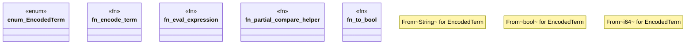

# `crates/praxis-graphlaw/src/sparql/eval.rs`

Source SHA-256: `7614ac3e732af9e8991290c94d26abc29ddd2ea9a9f8e34a6fa290c33c700b7e`

## Dependencies

- `crate::Encoder`
- `crate::tripleindex::EncodedBinding`
- `std::cmp::Ordering`
- `super::plan::PlanExpression`

## Standing

- Structural parse: `ALIVE`
- Runtime behavior: `UNKNOWN`
