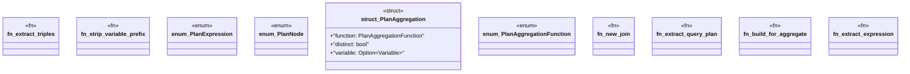

# `crates/praxis-graphlaw/src/sparql/plan.rs`

Source SHA-256: `f24f5870f5465a2e795139c4b8f9e0b12e6a3cbae9c5ff2ae556ae1c5cef8fb1`

## Dependencies

- `crate::{Encoder, Term, Triple}`
- `spargebra::algebra::*`
- `spargebra::term::Variable`
- `std::fmt::Error`
- `std::rc::Rc`

## Standing

- Structural parse: `ALIVE`
- Runtime behavior: `UNKNOWN`
