# `crates/praxis-graphlaw/src/sparql_test.rs`

Source SHA-256: `ee6725573eff5287dd669e935471ceb1710d88a8d3aaf62367c521495c11a4fc`

```mermaid
classDiagram
    class fn_prepare_test {
      <<fn>>
    }
    class fn_test_filter_greater_than {
      <<fn>>
    }
    class fn_test_filter_greater_than_or_equal {
      <<fn>>
    }
    class fn_test_filter_less_than {
      <<fn>>
    }
    class fn_test_group_by_count_aggregation {
      <<fn>>
    }
    class fn_test_group_by_count_aggregation_multiple_group {
      <<fn>>
    }
    class fn_test_group_by_sum_aggregation {
      <<fn>>
    }
    class fn_test_syntactic_sugar_rdf_type {
      <<fn>>
    }
```

## Dependencies

- `crate::{Parser, Syntax}`
- `super::*`

## Standing

- Structural parse: `ALIVE`
- Runtime behavior: `UNKNOWN`
