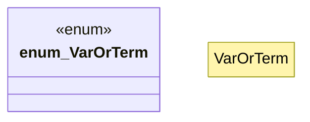

# `crates/praxis-graphlaw/src/term.rs`

Source SHA-256: `19aaabab7eba2d4a544c98f1000b850e623176cf824c52a57b05ba0b50f3e719`

## Dependencies

- `crate::Encoder`
- `crate::registry::{FORMULA_REGISTRY, LIST_INTERN, LIST_REGISTRY, SYNTHETIC_COUNTER}`
- `std::sync::atomic::Ordering`

## Standing

- Structural parse: `ALIVE`
- Runtime behavior: `UNKNOWN`
