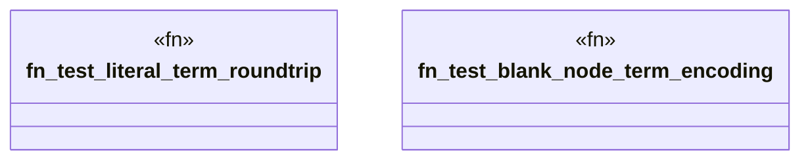

# `crates/praxis-graphlaw/src/term_test.rs`

Source SHA-256: `b208945c892cacfa796f32438701878c794b118bd8522f9269e0d421a40db3b1`

## Dependencies

- `crate::Encoder`
- `crate::term::{Term, VarOrTerm}`

## Standing

- Structural parse: `ALIVE`
- Runtime behavior: `UNKNOWN`
