# `crates/praxis-graphlaw/src/time_window.rs`

Source SHA-256: `d72864d594e0d6472c07db16eba77421ba9919b08a5c3e7f4ef7d51a072fab85`

```mermaid
classDiagram
    class trait_TimeWindowConsumer {
      <<trait>>
      +"update(&mut self, data: Vec~(i32, Rc~T~)"
    }
    class struct_SimpleWindowConsumer {
      <<struct>>
      +"windows: Vec~Box~TimeWindow~T~~~"
      +"data: Vec~(i32"
    }
    class struct_TimeWindow {
      <<struct>>
      +"content: LinkedList~(i32"
      +"consumers: Vec~Rc~RefCell~dyn TimeWindowConsumer~T~~~~"
      +"width: i32"
      +"slide: i32"
      +"time: i32"
      +"pending_adds: Vec~(i32"
    }
    class fn_test_new_window {
      <<fn>>
    }
    class fn_test_add_to_window {
      <<fn>>
    }
    class fn_test_window_shift {
      <<fn>>
    }
    class fn_test_window_bound_calculation {
      <<fn>>
    }
    class fn_test_consumer {
      <<fn>>
    }
    class fn_test_delete {
      <<fn>>
    }
    class fn_test_update {
      <<fn>>
    }
    note "Default for SimpleWindowConsumer~T~"
    note "SimpleWindowConsumer~T~"
    note "TimeWindow~T~"
    note "TimeWindowConsumer~T~ for SimpleWindowConsumer~T~"
```

## Dependencies

- `deepmesa_collections::LinkedList`
- `std::cell::RefCell`
- `std::cmp`
- `std::hash::Hash`
- `std::rc::Rc`

## Standing

- Structural parse: `ALIVE`
- Runtime behavior: `UNKNOWN`
