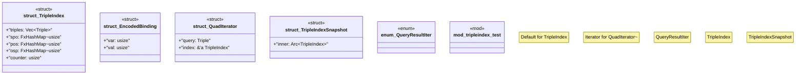

# `crates/praxis-graphlaw/src/tripleindex.rs`

Source SHA-256: `9419c27529c71aff900a255de9d6ee3d8d7437951b1492b252a8840eb2f74479`

## Dependencies

- `crate::fastmap::FxHashMap`
- `crate::{Binding, Term, Triple, VarOrTerm}`
- `std::iter::empty`
- `std::rc::Rc`
- `std::sync::Arc`

## Standing

- Structural parse: `ALIVE`
- Runtime behavior: `UNKNOWN`
