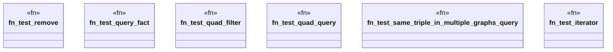

# `crates/praxis-graphlaw/src/tripleindex_test.rs`

Source SHA-256: `bc8ac16a3412e21a63e94ab18b173106cc83e09688d551f1c04adcb1429bc589`

## Dependencies

- `crate::{Encoder, Parser, Syntax}`
- `super::*`

## Standing

- Structural parse: `ALIVE`
- Runtime behavior: `UNKNOWN`
