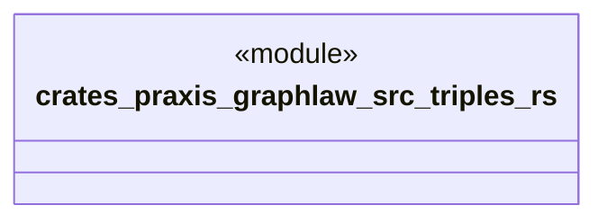

# `crates/praxis-graphlaw/src/triples.rs`

Source SHA-256: `2590c5f9e1644ce3dddbeea3c09dafb1263d6b729b12cc6caf869e09880ece6e`

## Dependencies

- `crate::rule::{Aggregate, AggregateFunction, BodyLiteral, Rule, DENIAL_HEAD_MARKER}`
- `crate::term::{BlankNodeImpl, LiteralImpl, Term, TermImpl, Triple, VarOrTerm, Variable}`

## Standing

- Structural parse: `ALIVE`
- Runtime behavior: `UNKNOWN`
