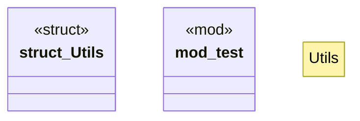

# `crates/praxis-graphlaw/src/utils.rs`

Source SHA-256: `18c739b4e94f02212879dbbd0bd7bf865fb0100cb75acbada4865c4827bd454f`

## Dependencies

- `crate::utils::Utils`
- `crate::{Encoder, Rule, Triple}`

## Standing

- Structural parse: `ALIVE`
- Runtime behavior: `UNKNOWN`
