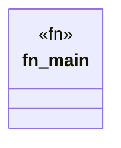

# `crates/praxis-graphlaw/test_empty.rs`

Source SHA-256: `c53223e47b2753d2c8734b9211c2a91b7c6f9c8727b53fa38b0676c31bac8034`

## Dependencies

- None observed.

## Standing

- Structural parse: `ALIVE`
- Runtime behavior: `UNKNOWN`
