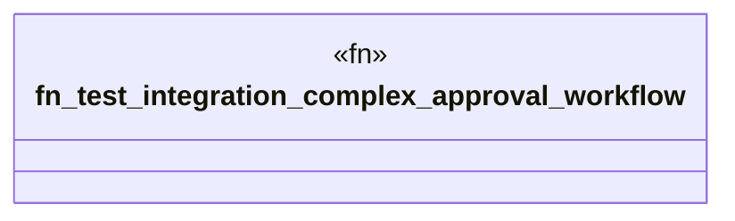

# `crates/praxis-graphlaw/tests/business_logic_cases_integration.rs`

Source SHA-256: `034a97a83db723d42c06811da99449c481a663e5e531462f92427e29cfca4a2b`

## Dependencies

- `praxis_graphlaw::TripleStore`
- `praxis_graphlaw::parser::Syntax`

## Standing

- Structural parse: `ALIVE`
- Runtime behavior: `UNKNOWN`
