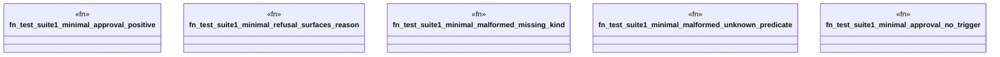

# `crates/praxis-graphlaw/tests/business_logic_cases_suite1.rs`

Source SHA-256: `d7ab3c718dabb92172cd1b8d27e9080a49c9cb4245d95b308b9d616c4f5f658c`

## Dependencies

- `praxis_graphlaw::TripleStore`
- `praxis_graphlaw::parser::Syntax`

## Standing

- Structural parse: `ALIVE`
- Runtime behavior: `UNKNOWN`
