# `crates/praxis-graphlaw/tests/business_logic_cases_suite2.rs`

Source SHA-256: `59bb2bed4f5b238a6047adffb108b1f8279d829475e8150d49d834d90fefeee2`

```mermaid
classDiagram
    class fn_test_suite2_approval_routing_single_entity {
      <<fn>>
    }
    class fn_test_suite2_approval_routing_100_entities {
      <<fn>>
    }
    class fn_test_suite2_approval_routing_priority_order {
      <<fn>>
    }
    class fn_test_suite2_approval_routing_exceed_12_hooks {
      <<fn>>
    }
    class fn_test_suite2_approval_routing_missing_priority {
      <<fn>>
    }
    class fn_test_suite2_approval_routing_bad_after_reference {
      <<fn>>
    }
```

## Dependencies

- `praxis_graphlaw::TripleStore`
- `praxis_graphlaw::parser::Syntax`

## Standing

- Structural parse: `ALIVE`
- Runtime behavior: `UNKNOWN`
