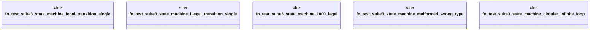

# `crates/praxis-graphlaw/tests/business_logic_cases_suite3.rs`

Source SHA-256: `465f9713cb29dd9205d9c0340f3f0c6360d5fbc2593073a2f7a7d41ea2a67e91`

## Dependencies

- `praxis_graphlaw::TripleStore`
- `praxis_graphlaw::parser::Syntax`

## Standing

- Structural parse: `ALIVE`
- Runtime behavior: `UNKNOWN`
