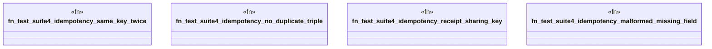

# `crates/praxis-graphlaw/tests/business_logic_cases_suite4.rs`

Source SHA-256: `7d2971b85968b3ee1f6522359729f4a2eaee4e33964a9ebee3ba912260c9ae7e`

## Dependencies

- `praxis_graphlaw::TripleStore`
- `praxis_graphlaw::parser::Syntax`

## Standing

- Structural parse: `ALIVE`
- Runtime behavior: `UNKNOWN`
