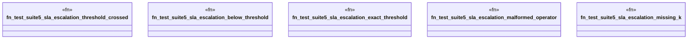

# `crates/praxis-graphlaw/tests/business_logic_cases_suite5.rs`

Source SHA-256: `b925fe0996f2a2ade0d4266eb68622f2ab88d03191994fb604fb02b14b2b612b`

## Dependencies

- `praxis_graphlaw::TripleStore`
- `praxis_graphlaw::parser::Syntax`

## Standing

- Structural parse: `ALIVE`
- Runtime behavior: `UNKNOWN`
