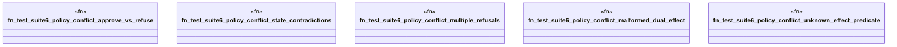

# `crates/praxis-graphlaw/tests/business_logic_cases_suite6.rs`

Source SHA-256: `a30330f49cc1c7f252b3d6c9180940b07882281874e7cae1afc675f8ef70072a`

## Dependencies

- `praxis_graphlaw::TripleStore`
- `praxis_graphlaw::parser::Syntax`

## Standing

- Structural parse: `ALIVE`
- Runtime behavior: `UNKNOWN`
