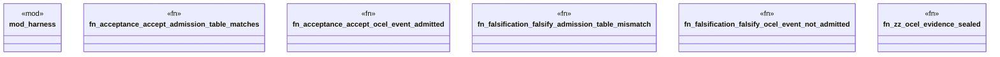

# `crates/praxis-graphlaw/tests/chatman_acceptance_admission.rs`

Source SHA-256: `62ef175adf418dad4a1bb2afc33d8daf73b9e8cbcff79e4890a2996b7c0dc587`

## Dependencies

- `praxis_graphlaw::chatman::Refusal`

## Standing

- Structural parse: `ALIVE`
- Runtime behavior: `UNKNOWN`
