# `crates/praxis-graphlaw/tests/chatman_acceptance_agents.rs`

Source SHA-256: `6d21bf065b2b24ef02bf4d8c23da9adac5cdd34a2c28e44af8c8841d3faaf5b1`

```mermaid
classDiagram
    class mod_harness {
      <<mod>>
    }
    class fn_acceptance_accept_agent_acts_within_permits {
      <<fn>>
    }
    class fn_acceptance_accept_permitted_breed_executes {
      <<fn>>
    }
    class fn_acceptance_accept_witness_observes_only {
      <<fn>>
    }
    class fn_falsification_falsify_agent_override_denied {
      <<fn>>
    }
    class fn_falsification_falsify_breed_unpermitted {
      <<fn>>
    }
    class fn_falsification_falsify_witness_not_authority {
      <<fn>>
    }
    class fn_zz_ocel_evidence_sealed {
      <<fn>>
    }
```

## Dependencies

- `praxis_graphlaw::chatman::Refusal`

## Standing

- Structural parse: `ALIVE`
- Runtime behavior: `UNKNOWN`
