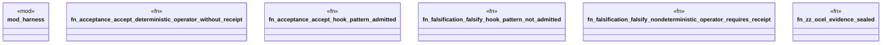

# `crates/praxis-graphlaw/tests/chatman_acceptance_hooks.rs`

Source SHA-256: `b8ffdc5afbb79ed3c86b12037b1a05facf4ce4e15c6a3cade06d873d6eedf968`

## Dependencies

- `praxis_graphlaw::chatman::Refusal`

## Standing

- Structural parse: `ALIVE`
- Runtime behavior: `UNKNOWN`
