# `crates/praxis-graphlaw/tests/chatman_acceptance_receipts.rs`

Source SHA-256: `a2d58c4c5fef7f6ed734de84d9b4fc431ca1c1da9370afb16e19436b72f54ce3`

```mermaid
classDiagram
    class mod_harness {
      <<mod>>
    }
    class fn_acceptance_accept_boundary_request_carries_receipt {
      <<fn>>
    }
    class fn_acceptance_accept_profile_hash_matches {
      <<fn>>
    }
    class fn_acceptance_accept_projection_hash_matches {
      <<fn>>
    }
    class fn_falsification_falsify_boundary_request_missing_receipt {
      <<fn>>
    }
    class fn_falsification_falsify_profile_hash_mismatch {
      <<fn>>
    }
    class fn_falsification_falsify_projection_hash_mismatch {
      <<fn>>
    }
    class fn_zz_ocel_evidence_sealed {
      <<fn>>
    }
```

## Dependencies

- `praxis_graphlaw::chatman::Refusal`

## Standing

- Structural parse: `ALIVE`
- Runtime behavior: `UNKNOWN`
