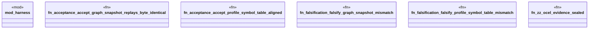

# `crates/praxis-graphlaw/tests/chatman_acceptance_replay.rs`

Source SHA-256: `2027bbc6dc7aeea76dc29dac9ad49ce74016fddafadcbfc7837983acd0993d76`

## Dependencies

- `praxis_graphlaw::chatman::Refusal`

## Standing

- Structural parse: `ALIVE`
- Runtime behavior: `UNKNOWN`
