# `crates/praxis-graphlaw/tests/chatman_acceptance_routing.rs`

Source SHA-256: `9c654e87bbf10e0cbebda92b90b082f189021ce20e6f46b581e4af6de5bb8283`

```mermaid
classDiagram
    class mod_harness {
      <<mod>>
    }
    class fn_acceptance_accept_hot_path_route_for_bounded_pattern {
      <<fn>>
    }
    class fn_acceptance_accept_supported_dialect_route {
      <<fn>>
    }
    class fn_falsification_falsify_least_expressive_route_violation {
      <<fn>>
    }
    class fn_falsification_falsify_n3_actuation_refused {
      <<fn>>
    }
    class fn_falsification_falsify_n3_unavailable_by_profile {
      <<fn>>
    }
    class fn_falsification_falsify_route_decision_mismatch {
      <<fn>>
    }
    class fn_falsification_falsify_unsupported_dialect {
      <<fn>>
    }
    class fn_falsification_falsify_warm_path_required {
      <<fn>>
    }
    class fn_zz_ocel_evidence_sealed {
      <<fn>>
    }
```

## Dependencies

- `praxis_graphlaw::chatman::Refusal`

## Standing

- Structural parse: `ALIVE`
- Runtime behavior: `UNKNOWN`
