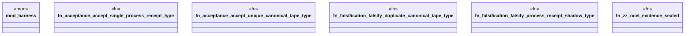

# `crates/praxis-graphlaw/tests/chatman_acceptance_static.rs`

Source SHA-256: `39f775caab737631cbe4646677e2b83b527fd5aa609912bb987f5de49a335eef`

## Dependencies

- `praxis_graphlaw::chatman::Refusal`

## Standing

- Structural parse: `ALIVE`
- Runtime behavior: `UNKNOWN`
