# `crates/praxis-graphlaw/tests/chatman_acceptance_triple8.rs`

Source SHA-256: `e0cf2522a4649c7b57cd1c0313beaba2dc887d68838000bab723b3c62418462d`

```mermaid
classDiagram
    class mod_harness {
      <<mod>>
    }
    class fn_acceptance_accept_snapshot_contains_only_atomic_terms {
      <<fn>>
    }
    class fn_acceptance_accept_terms_resolve_in_triple8_universe {
      <<fn>>
    }
    class fn_acceptance_accept_triple8_universe_within_bounds {
      <<fn>>
    }
    class fn_falsification_falsify_term_not_in_triple8_universe {
      <<fn>>
    }
    class fn_falsification_falsify_triple8_universe_overflow {
      <<fn>>
    }
    class fn_falsification_falsify_triple8_universe_overflow_by_one {
      <<fn>>
    }
    class fn_falsification_falsify_triple_term_in_snapshot {
      <<fn>>
    }
    class fn_zz_ocel_evidence_sealed {
      <<fn>>
    }
```

## Dependencies

- `praxis_graphlaw::chatman::Refusal`

## Standing

- Structural parse: `ALIVE`
- Runtime behavior: `UNKNOWN`
