# `crates/praxis-graphlaw/tests/chatman_cli_sabotage.rs`

Source SHA-256: `cd5d2f46eafe76362d0789dc3b04b86ed837d59a70f053012b885726854a4dbb`

```mermaid
classDiagram
    class fn_test_profile {
      <<fn>>
    }
    class fn_envelope {
      <<fn>>
    }
    class fn_xor_every_file_in_dir {
      <<fn>>
    }
    class fn_on_disk_store_sabotage_is_refused_or_undetectable_on_reopen {
      <<fn>>
    }
    class fn_receipt_to_json {
      <<fn>>
    }
    class fn_receipt_from_json {
      <<fn>>
    }
    class fn_sabotaged_receipt_fixture_is_detected_by_verify_replay {
      <<fn>>
    }
    class fn_sabotage_fixture_bit_flip_on_receipt_json_is_detected {
      <<fn>>
    }
```

## Dependencies

- `chicago_tdd_tools::cli_proof::{SabotageFixture, TempWorkspace}`
- `praxis_graphlaw::chatman::abi::{ Digest, GraphSnapshotId, InputHandles, InvocationEnvelope, InvocationId, OperatorId, ProfileId, Refusal, }`
- `praxis_graphlaw::chatman::engine::{ AdmissionSpec, ChatmanEngine, EngineProcessReceipt, EngineProfile, ReplayInputs, ReplayMismatch, }`
- `praxis_graphlaw::chatman::router::ProfileGates`
- `praxis_graphlaw::chatman::triple8::ProfileSymbolTable`
- `std::fs`

## Standing

- Structural parse: `ALIVE`
- Runtime behavior: `UNKNOWN`
