# `crates/praxis-graphlaw/tests/chatman_engine_acceptance/harness/mod.rs`

Source SHA-256: `2b9e5c96c234977b34c4a50b307cf4e667d92593b3cdd9b47008d44e3e4e68ee`

```mermaid
classDiagram
    class enum_ScenarioKind {
      <<enum>>
    }
    class struct_Scenario {
      <<struct>>
      +"case: String"
      +"kind: ScenarioKind"
      +"seed: u64"
      +"mutation: Option~String~"
      +"expected_refusal: Option~String~"
      +"expected_behavior: Option~String~"
      +"input: ScenarioInput"
    }
    class struct_ProfileHashCheck {
      <<struct>>
      +"claimed_profile_id: String"
      +"engine_profile_id: String"
    }
    class struct_ProjectionHashCheck {
      <<struct>>
      +"snapshot_id: String"
      +"universe: Vec~String~"
      +"triples: Vec~[String; 3]~"
      +"recorded_hash: String"
    }
    class struct_ReceiptInput {
      <<struct>>
      +"subject: String"
      +"witness: String"
      +"replay_hint: String"
      +"canon_nquads: String"
      +"carried_digest: Option~String~"
      +"profile_hash_check: Option~ProfileHashCheck~"
      +"projection_hash_check: Option~ProjectionHashCheck~"
    }
    class struct_RoutingInput {
      <<struct>>
      +"profile_id: String"
      +"requested_dialect: String"
      +"admitted_dialects: Vec~String~"
      +"recorded_route: Option~String~"
      +"wants_actuation: Option~bool~"
      +"constraint_count: Option~u8~"
    }
    class struct_Triple8Input {
      <<struct>>
      +"universe: Vec~String~"
      +"terms: Vec~String~"
      +"overflow_terms: Option~Vec~String~~"
    }
    class struct_AdmissionEntry {
      <<struct>>
      +"pattern: String"
      +"admitted: bool"
    }
    class struct_AdmissionTableInput {
      <<struct>>
      +"table_hash: String"
      +"entries: Vec~AdmissionEntry~"
      +"ocel_event: Option~String~"
    }
    class struct_HookInput {
      <<struct>>
      +"hook_iri: String"
      +"pattern: String"
      +"admitted_patterns: Vec~String~"
      +"nondeterministic: bool"
      +"has_receipt: bool"
    }
    class struct_AgentInput {
      <<struct>>
      +"agent_id: String"
      +"operator_id: String"
      +"override_requested: Option~bool~"
      +"breed_requested: Option~bool~"
      +"witness_presented_as_authority: Option~bool~"
    }
    class struct_ReplayHandles {
      <<struct>>
      +"nodes: Vec~String~"
      +"events: Vec~String~"
      +"plan_steps: Vec~String~"
    }
    class struct_ReplayEnvelope {
      <<struct>>
      +"invocation_id: String"
      +"snapshot_id: String"
      +"profile_id: String"
      +"operator_id: String"
      +"input_handles: ReplayHandles"
    }
    class struct_ReplayReceiptRef {
      <<struct>>
      +"subject: String"
      +"digest: String"
    }
    class struct_ReplayInput {
      <<struct>>
      +"envelope: ReplayEnvelope"
      +"receipts: Vec~ReplayReceiptRef~"
      +"recorded_envelope_hash: Option~String~"
      +"symbol_universe: Option~Vec~String~~"
      +"recorded_symbol_table_hash: Option~String~"
    }
    class struct_StaticGateInput {
      <<struct>>
      +"gate: String"
      +"source: String"
    }
    class enum_ScenarioInput {
      <<enum>>
    }
    class fn_fixture_root {
      <<fn>>
    }
    class fn_load {
      <<fn>>
    }
    class struct_AdmittedOutcome {
      <<struct>>
      +"case: String"
      +"suite: &'static str"
      +"detail: String"
    }
    class fn_run_fixture {
      <<fn>>
    }
    class fn_dispatch_scenario {
      <<fn>>
    }
    class fn_seal_suite_evidence {
      <<fn>>
    }
    class fn_dispatch_receipt {
      <<fn>>
    }
    class fn_dialect_from_name {
      <<fn>>
    }
    class fn_shape_for_dialect {
      <<fn>>
    }
    class fn_dispatch_routing {
      <<fn>>
    }
    class fn_dispatch_triple8 {
      <<fn>>
    }
    class fn_dispatch_admission_table {
      <<fn>>
    }
    class fn_dispatch_hook {
      <<fn>>
    }
    class fn_dispatch_agent {
      <<fn>>
    }
    class fn_dispatch_replay {
      <<fn>>
    }
    class fn_dispatch_static_gate {
      <<fn>>
    }
    class fn_ocel_sink {
      <<fn>>
    }
    class fn_next_ordinal {
      <<fn>>
    }
    class fn_emit_outcome {
      <<fn>>
    }
    class fn_record_admitted {
      <<fn>>
    }
    class fn_record_refused {
      <<fn>>
    }
    class struct_SealGuard {
      <<struct>>
      +"suite: &'static str"
    }
    note "Drop for SealGuard"
    note "ScenarioInput"
    note "SealGuard"
```

## Dependencies

- `chicago_tdd_tools::core::governance::{ Diagnostic, DiagnosticCategory, DiagnosticCode, DiagnosticSink, }`
- `chicago_tdd_tools::observability::ocel::collector::OcelCollector`
- `chicago_tdd_tools::observability::ocel::wasm4pm::seal_run`
- `praxis_graphlaw::chatman::abi::Refusal`
- `praxis_graphlaw::chatman::abi::{ GraphSnapshotId, InputHandles, InvocationEnvelope, InvocationId, OperatorId, ProfileId, Receipt, }`
- `praxis_graphlaw::chatman::admission8::{AdmissionTable8, ConstraintMask}`
- `praxis_graphlaw::chatman::router`
- `praxis_graphlaw::chatman::router::{Dialect, DialectRouter, ProfileGates, QueryShape}`
- `praxis_graphlaw::chatman::triple8::{ProfileSymbolTable, RDFTriple8}`
- `serde::Deserialize`
- `std::path::{Path, PathBuf}`
- `std::sync::OnceLock`
- `std::sync::atomic::{AtomicU64, Ordering}`

## Standing

- Structural parse: `ALIVE`
- Runtime behavior: `UNKNOWN`
