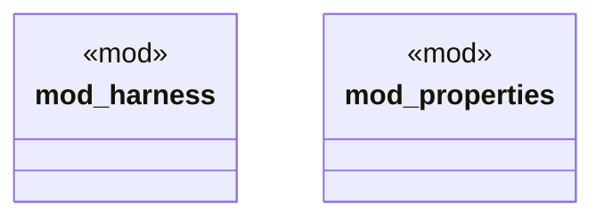

# `crates/praxis-graphlaw/tests/chatman_engine_acceptance/main.rs`

Source SHA-256: `52a29a0591a439c35707a1a8baaf28d75b0d23c645d59532c98b8063341e2c28`

## Dependencies

- None observed.

## Standing

- Structural parse: `ALIVE`
- Runtime behavior: `UNKNOWN`
