# `crates/praxis-graphlaw/tests/chatman_engine_acceptance/properties.rs`

Source SHA-256: `8b24449c32148e6902950cdd2c03ddc002f481cfc0ef11243a1cf9e01bd140a3`

```mermaid
classDiagram
    class fn_runner_for {
      <<fn>>
    }
    class fn_canonical_nquads {
      <<fn>>
    }
    class fn_prop_distinct_inputs_distinct_receipts {
      <<fn>>
    }
    class fn_prop_replay_input_specific {
      <<fn>>
    }
    class fn_prop_refusals_specific {
      <<fn>>
    }
    class fn_make_refusal {
      <<fn>>
    }
    class fn_write_scratch_scenario {
      <<fn>>
    }
    class fn_prop_route_depends_on_shape {
      <<fn>>
    }
    class fn_prop_overflow_changes_outcome {
      <<fn>>
    }
    class fn_prop_masks_match_arithmetic_truth {
      <<fn>>
    }
    class fn_prop_actuation_requires_receipt {
      <<fn>>
    }
    class fn_prop_agent_cannot_override {
      <<fn>>
    }
```

## Dependencies

- `crate::harness`
- `praxis_graphlaw::chatman::abi::GraphSnapshotId`
- `praxis_graphlaw::chatman::abi::{ InputHandles, InvocationEnvelope, InvocationId, OperatorId, ProfileId, Receipt, Refusal, ALL_REFUSAL_NAMES, }`
- `proptest::prelude::*`
- `proptest::test_runner::{Config, TestRng, TestRunner}`
- `std::path::PathBuf`

## Standing

- Structural parse: `ALIVE`
- Runtime behavior: `UNKNOWN`
