# `crates/praxis-graphlaw/tests/chatman_external_cut_refusal_catalog.rs`

Source SHA-256: `e116f6df04ff4c1ec8511f4b65dbe85192dd226cc4d13c457f82a773d5564829`

```mermaid
classDiagram
    class fn_model_with_external_cut {
      <<fn>>
    }
    class fn_external_cut_undeclared_fires_on_a_real_empty_projection {
      <<fn>>
    }
    class fn_powl_region_not_admitted_fires_on_a_real_nested_cut {
      <<fn>>
    }
    class fn_external_cut_type_mismatch_fires_on_a_real_socket_path_naming_a_leaf {
      <<fn>>
    }
    class fn_external_cut_authority_mismatch_fires_on_a_real_cross_tenant_provenance_claim {
      <<fn>>
    }
    class fn_a_well_formed_external_cut_is_admitted_end_to_end {
      <<fn>>
    }
```

## Dependencies

- `powl2_decompose::{Powl, SocketPath}`
- `praxis_graphlaw::chatman::abi::Refusal`
- `praxis_graphlaw::chatman::powl_projection::{powl_to_turtle, resolve_external_cut_at}`
- `std::collections::BTreeSet`

## Standing

- Structural parse: `ALIVE`
- Runtime behavior: `UNKNOWN`
