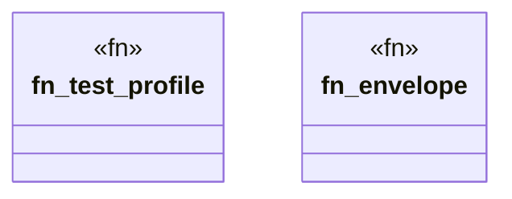

# `crates/praxis-graphlaw/tests/chatman_hooks_ocel.rs`

Source SHA-256: `758ec8d35dcf9223620cbf74541552a062564482f3e56920908374016ea6cad3`

## Dependencies

- `chicago_tdd_tools::prelude::*`
- `praxis_graphlaw::chatman::abi::{ GraphSnapshotId, InputHandles, InvocationEnvelope, InvocationId, OperatorId, ProfileId, Refusal, }`
- `praxis_graphlaw::chatman::engine::{AdmissionSpec, ChatmanEngine, EngineProfile}`
- `praxis_graphlaw::chatman::router::ProfileGates`
- `praxis_graphlaw::chatman::triple8::ProfileSymbolTable`

## Standing

- Structural parse: `ALIVE`
- Runtime behavior: `UNKNOWN`
