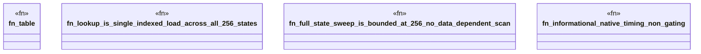

# `crates/praxis-graphlaw/tests/chatman_hotpath.rs`

Source SHA-256: `b3d63a26ea75f34aadb1bb2df23ac0275e7c64d3343854fc877adfcce77cb7ab`

## Dependencies

- `chicago_tdd_tools::prelude::*`
- `praxis_graphlaw::chatman::abi::Refusal`
- `praxis_graphlaw::chatman::admission8::{AdmissionTable8, ConstraintMask}`

## Standing

- Structural parse: `ALIVE`
- Runtime behavior: `UNKNOWN`
