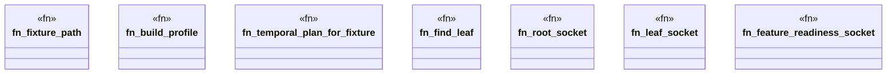

# `crates/praxis-graphlaw/tests/chatman_pddl_to_powl_art_dag_cross_story.rs`

Source SHA-256: `fdd241d08d00bb1d0ad612d6f01b0328d997a35aba6c1afac423586687a4404d`

## Dependencies

- `bcinr_pddl::TemporalPlan`
- `chicago_tdd_tools::prelude::*`
- `powl2_decompose::{ParentChildClosure, Powl, SocketKind, SocketPath, WorkflowSocketId}`
- `praxis_graphlaw::chatman::abi::{GraphSnapshotId, ProfileId, Refusal}`
- `praxis_graphlaw::chatman::closure::{ClosureLaw, RecursiveSocketClosure}`
- `praxis_graphlaw::chatman::engine::{AdmissionSpec, ChatmanEngine, EngineProfile}`
- `praxis_graphlaw::chatman::powl_projection::project_temporal_plan_to_powl`
- `praxis_graphlaw::chatman::router::ProfileGates`
- `praxis_graphlaw::chatman::triple8::ProfileSymbolTable`
- `std::collections::BTreeSet`
- `std::fs`
- `std::path::PathBuf`

## Standing

- Structural parse: `ALIVE`
- Runtime behavior: `UNKNOWN`
