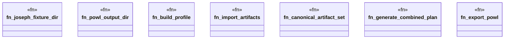

# `crates/praxis-graphlaw/tests/chatman_pddl_to_powl_joseph_famine.rs`

Source SHA-256: `4ec472c9951ac739b1e829d9a95ffb5e5515436d1050a6eb29108ba8a9b5daaf`

## Dependencies

- `bcinr_pddl::Pddl8Tape`
- `chicago_tdd_tools::prelude::*`
- `oxigraph::io::{RdfFormat, RdfParser}`
- `oxigraph::store::Store`
- `powl2_decompose::Powl`
- `praxis_graphlaw::chatman::abi::{GraphSnapshotId, ProfileId, Refusal}`
- `praxis_graphlaw::chatman::engine::{AdmissionSpec, ChatmanEngine, EngineProfile}`
- `praxis_graphlaw::chatman::powl_projection::{powl_to_turtle, project_pddl_tape_to_powl}`
- `praxis_graphlaw::chatman::router::ProfileGates`
- `praxis_graphlaw::chatman::triple8::ProfileSymbolTable`
- `std::fs`
- `std::path::PathBuf`

## Standing

- Structural parse: `ALIVE`
- Runtime behavior: `UNKNOWN`
