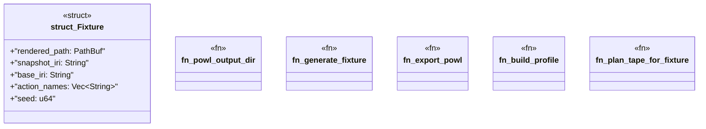

# `crates/praxis-graphlaw/tests/chatman_pddl_to_powl_projection.rs`

Source SHA-256: `aed0caf212f1ea06a5522758a6d86554bb04117e4b8541ff174184bf8bf1c3ca`

## Dependencies

- `bcinr_pddl::Pddl8Tape`
- `chicago_tdd_tools::prelude::*`
- `fake::Fake`
- `fake::faker::lorem::en::Word`
- `oxigraph::io::{RdfFormat, RdfParser}`
- `oxigraph::store::Store`
- `powl2_decompose::Powl`
- `praxis_graphlaw::chatman::abi::{GraphSnapshotId, ProfileId, Refusal}`
- `praxis_graphlaw::chatman::engine::{AdmissionSpec, ChatmanEngine, EngineProfile}`
- `praxis_graphlaw::chatman::powl_projection::{powl_to_turtle, project_pddl_tape_to_powl}`
- `praxis_graphlaw::chatman::router::ProfileGates`
- `praxis_graphlaw::chatman::triple8::ProfileSymbolTable`
- `rand::SeedableRng`
- `rand::rngs::StdRng`
- `std::fs`
- `std::path::PathBuf`
- `std::sync::atomic::{AtomicU64, Ordering}`

## Standing

- Structural parse: `ALIVE`
- Runtime behavior: `UNKNOWN`
