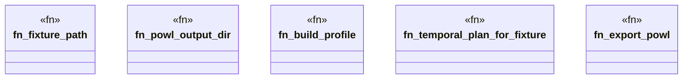

# `crates/praxis-graphlaw/tests/chatman_pddl_to_powl_temporal_concurrency.rs`

Source SHA-256: `2025c643eacdb6365b619b3a0f356ea823242afc1fe1ce72ac231a827ea21582`

## Dependencies

- `bcinr_pddl::{TemporalPlan, TemporalPlanStep}`
- `chicago_tdd_tools::prelude::*`
- `oxigraph::io::{RdfFormat, RdfParser}`
- `oxigraph::sparql::{QueryResults, SparqlEvaluator}`
- `oxigraph::store::Store`
- `powl2_decompose::Powl`
- `praxis_graphlaw::chatman::abi::{GraphSnapshotId, ProfileId, Refusal}`
- `praxis_graphlaw::chatman::engine::{AdmissionSpec, ChatmanEngine, EngineProfile}`
- `praxis_graphlaw::chatman::powl_projection::{powl_to_turtle, project_temporal_plan_to_powl}`
- `praxis_graphlaw::chatman::router::ProfileGates`
- `praxis_graphlaw::chatman::triple8::ProfileSymbolTable`
- `std::fs`
- `std::path::PathBuf`

## Standing

- Structural parse: `ALIVE`
- Runtime behavior: `UNKNOWN`
