# `crates/praxis-graphlaw/tests/chatman_receipts_chain.rs`

Source SHA-256: `1a841d8196964bb24f124ded5c83367af1f3a82d0736229dbf079ffaf69a2c58`

```mermaid
classDiagram
    class fn_synthetic_three_entry_chain_validates_ok {
      <<fn>>
    }
    class fn_tampered_chain_entry_is_detected {
      <<fn>>
    }
    class fn_tampered_chain_hash_field_is_detected {
      <<fn>>
    }
    class fn_test_profile {
      <<fn>>
    }
    class fn_envelope {
      <<fn>>
    }
    class fn_admitted_transition {
      <<fn>>
    }
    class fn_replay_inputs {
      <<fn>>
    }
    class fn_wrong_digest {
      <<fn>>
    }
    class fn_verify_replay_accepts_faithful_receipt {
      <<fn>>
    }
    class fn_verify_replay_field_1_graph_snapshot_mismatch {
      <<fn>>
    }
    class fn_verify_replay_field_2_profile_mismatch {
      <<fn>>
    }
    class fn_verify_replay_field_3_symbol_table_mismatch {
      <<fn>>
    }
    class fn_verify_replay_field_4_projection_mismatch {
      <<fn>>
    }
    class fn_verify_replay_field_5_admission_table_mismatch {
      <<fn>>
    }
    class fn_verify_replay_field_6_route_decision_mismatch {
      <<fn>>
    }
    class fn_verify_replay_field_7_tape_mismatch {
      <<fn>>
    }
    class fn_verify_replay_field_8_hook_event_mismatch {
      <<fn>>
    }
    class fn_verify_replay_field_9_engine_version_mismatch {
      <<fn>>
    }
    class fn_verify_replay_receipt_root_mismatch {
      <<fn>>
    }
    class fn_verify_replay_refused_when_snapshot_turtle_is_malformed {
      <<fn>>
    }
```

## Dependencies

- `chicago_tdd_tools::observability::receipt::{Blake3ChainValidator, ReceiptChainBuilder}`
- `praxis_graphlaw::chatman::abi::{ Digest, GraphSnapshotId, InputHandles, InvocationEnvelope, InvocationId, OperatorId, ProfileId, Refusal, }`
- `praxis_graphlaw::chatman::engine::{ AdmissionSpec, ChatmanEngine, EngineProfile, ReplayInputs, ReplayMismatch, }`
- `praxis_graphlaw::chatman::router::ProfileGates`
- `praxis_graphlaw::chatman::triple8::ProfileSymbolTable`

## Standing

- Structural parse: `ALIVE`
- Runtime behavior: `UNKNOWN`
