# `crates/praxis-graphlaw/tests/chatman_refusal_governance.rs`

Source SHA-256: `229e304054cc87f7a3c89e856fc46939370283496e76447585d0584286901cc4`

```mermaid
classDiagram
    class fn_all_refusal_names_has_exactly_forty_six_entries {
      <<fn>>
    }
    class fn_governed_list_is_set_equal_to_all_refusal_names {
      <<fn>>
    }
    class fn_all_refusal_names_are_unique {
      <<fn>>
    }
    class fn_test_profile {
      <<fn>>
    }
    class fn_envelope {
      <<fn>>
    }
    class fn_provokes_snapshot_not_found {
      <<fn>>
    }
    class fn_provokes_triple_term_in_snapshot {
      <<fn>>
    }
    class fn_provokes_unsupported_dialect {
      <<fn>>
    }
    class fn_provokes_plan_infeasible {
      <<fn>>
    }
    class fn_provokes_trace_unlawful {
      <<fn>>
    }
    class fn_provokes_profile_hash_mismatch {
      <<fn>>
    }
```

## Dependencies

- `chicago_tdd_tools::prelude::*`
- `praxis_graphlaw::chatman::abi::{ GraphSnapshotId, InputHandles, InvocationEnvelope, InvocationId, OperatorId, ProfileId, Refusal, ALL_REFUSAL_NAMES, }`
- `praxis_graphlaw::chatman::engine::{AdmissionSpec, ChatmanEngine, EngineProfile}`
- `praxis_graphlaw::chatman::router::{Dialect, ProfileGates}`
- `praxis_graphlaw::chatman::triple8::ProfileSymbolTable`
- `std::collections::BTreeSet`

## Standing

- Structural parse: `ALIVE`
- Runtime behavior: `UNKNOWN`
