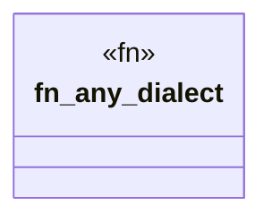

# `crates/praxis-graphlaw/tests/chatman_router_properties.rs`

Source SHA-256: `60a4cb406f7f346b9389d5934d229c609f8fcfeb6ccf446cfe91d9cfb0455fd7`

## Dependencies

- `chicago_tdd_tools::assert_matches`
- `chicago_tdd_tools::prelude::*`
- `praxis_graphlaw::chatman::abi::{ProfileId, Refusal}`
- `praxis_graphlaw::chatman::router::{Dialect, DialectRouter, ProfileGates, QueryShape}`
- `proptest::prelude::*`

## Standing

- Structural parse: `ALIVE`
- Runtime behavior: `UNKNOWN`
